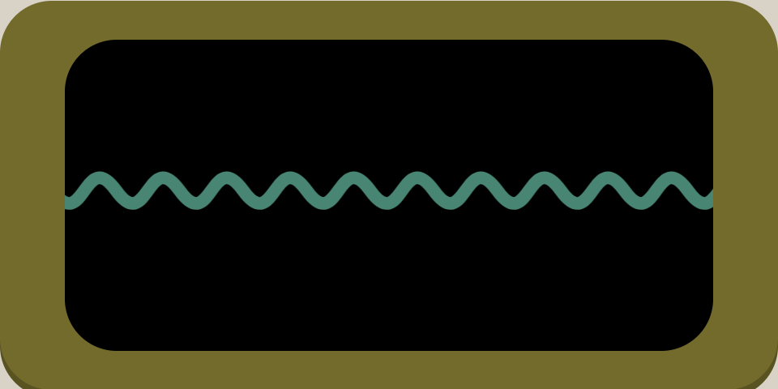
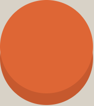
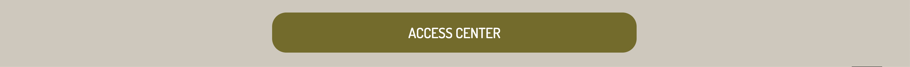
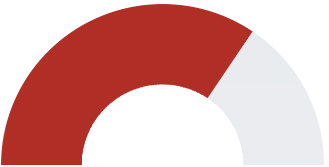
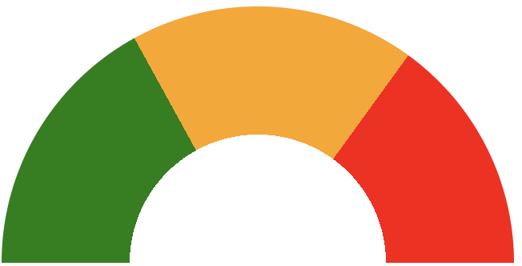

# Access Center

## Week 1

Ik heb gekozen voor de opdracht om een stijlvast bedieningspaneel te maken.

[De opdracht](https://cmda-minor-web.github.io/css-to-the-rescue-2122/index.html#bedieningspaneel) luidt als volgt:

> 'Formulieren zijn al sinds de oerknal van het web een essentiële schakel voor interactie. Ze waren (te) lang notoir lastig om te stijlen :-( Maar nu niet meer :-) Aan jou de opdracht om een stijlvast en werkend bedieningspaneel te creëren.'

Om inspiratie op te doen heb ik gekeken naar https://control--panel.com/, hier staan allemaal verschillende soorten bedieningspanelen. Daar kwam ik [dit](https://tmblr.co/Z7RVXw1kiZJI7) tegen en mij leek het wel geinig om hiermee aan de slag te gaan.

Na een stukje scrollen kwam ik ook deze 'auto' tegen: [de Citroën Karin](https://tmblr.co/Z7RVXw1a0uRTo). Omdat ik al een beetje wist wat ik wilde gaan doen leek het me wel leuk om deze vintage stijl / kleur erin te implementeren.


Ik begon heel simpel met een checkbox die de kleur van een ander element wijzigde en dit heb ik uiteindelijk uitgewerkt tot een scherm met een wavy underline die wordt activeerd door een oranje knop.



## Week 2

In de tweede week heb ik de workshop vormpjes maken gevolgd, deze vormpjes werden allemaal aan de hand van gradients gemaakt. Ik gebruikte css voornamelijk voor positioneren, kleur toepassen en de wat meer 'standaard' dingen en vond ik het erg leerzaam om te zien dat niet voor ieder item een aparte `div` nodig is maar dat het ook bijvoorbeeld kan met meerdere `conic-gradient`. Mensen kunnen daar de gekste dingen mee maken (zoals op https://a.singlediv.com) en was dit ook zeker een eye-opener wat ik vaker wil toepassen.

Dat heb ik dan ook meteen gedaan door een soort sonar te maken (https://codepen.io/zainuwachtig/pen/KKyZqqo), de juiste breedte van de lijnen heb ik zo gekregen door de hele tijd met deze waardes te spelen.

```css
background: repeating-radial-gradient(
  circle,
  #000000,
  #000000 24px,
  #2f8772 0,
  #2f8772 30px
);
```

Sanne heeft me geholpen met het animeren ervan, alleen de rode stippen juist op de sonar te laten knipperen is nog niet gelukt, de tip van Vasilis was om het met `mix-blend-mode` te doen.

Ook heb ik de workshop form states gevolgd over verschillende manieren om een form te stylen en heb ik dat ook verwerkt in de access center, wat je nu kan veranderen naar wat je zelf wil.


Bij de workshop heb ik ook wat geleerd over de nog niet uitgebrachte `:has()` selector. Deze is momenteel alleen beschikbaar in Safari Technology Preview, dus besloot ik dat te downloaden en ermee te experimenteren. Met `:has()` wilde ik dat wanneer je in het input 'afsluiten' of iets dergelijks typte, de access room zichzelf een soort 'afsloot', alleen dit bleek nog meer een uitdaging dan ik dacht. De codepen stond in Safari TP alleen was ik niet ingelogd waardoor die niet is opgeslagen :frowning_face:.

Ook heb ik een laser gemaakt die uit een gaatje komt wanneer je op een checkbox drukt. Ik deed dit met een `::before` (voor de laser), die `::before` probeerde ik te draaien en begreep al niet waarom dat zo'n lastig iets was omdat ik steeds de laser opnieuw moest positioneren. Daarna kwam ik tot inzien dat het slimmer was om `display: flex` op het gaatje te zetten met een `align-items`, zo kan ik het gaatje draaien in plaats van de laser. (https://codepen.io/zainuwachtig/pen/yLPmoEX)

## Week 3

In week 3 heb ik de workshop custom properties gevolgd. Ik had er wel al eens van gehoord en gebruikt voor kleuren maar meer dan dat ook niet, omdat ik zelf ook niet echt overtuigd was dat je er meer mee kon doen. Na afloop van de workshop kwam ik wel tot de conclusie dat je er meer mee kan dan alleen kleurtjes, ik wist zelf niet goed hoe ik het in mijn opdracht kon implementeren naast een light en dark mode. (_Afbeelding nog invoegen van light en dark mode_).

Daarnaast ben ik aan de slag gegaan met een hendel, wat die ging doen wist ik alleen nog niet.
(https://codepen.io/zainuwachtig/pen/QWOzwjY). Dit was wel een dingetje en hier ben ik ook aardig zoet mee geweest. Toen eenmaal het animeren was gelukt (met hulp van Sanne) was het positioneren van de de hendel mis gegaan en moest dus alles opnieuw gepositioneerd worden. Uiteindelijk is het me wel gelukt en heb ik nieuwe dingen geleerd over de `::before` en `::after`, maar ook over de `z-index` en `perspective`.

Ten slotte heb ik nog een deel van css wat opgeschoond en 'ge-refactord'.

## Week 4

In de laatste week heb ik nog een graadmeter toegevoegd die zogenaamd het danger level aangeeft. Het leek me wel een leuk idee om dat dan met drie kleuren te doen (van groen naar geel naar rood), maar eerst was het al een aardige opgave om het met 1 kleur te doen. Ik begon met een `::before` en `::after` om de graadmeter te maken, alleen toen kwam ik in de knoop met de vulling (https://codepen.io/zainuwachtig/pen/abVPPVZ?editors=1100) maar kreeg hem uiteindelijk wel aan de praat. Vervolgens heeft Sanne uitgelegd hoe ik de graadmeter met verschillende kleuren kon maken en heb ik daar zelf de drie kleuren in verwerkt (https://codepen.io/zainuwachtig/pen/YzEoZem?editors=1100). Het is me alleen niet gelukt om er een box-shadow op te zetten zoals bij de andere objecten, dit is omdat ik een mask gebruik dus het witte vlak hoort bij het object zelf en staat niet los van de graadmeter.




